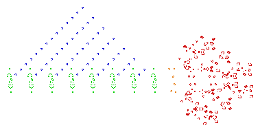
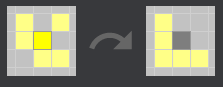
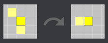
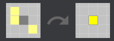

# Game of Life

The Game of Life is a cellular-automaton, zero-player game, developed by Cambridge mathematician John Conway in 1970. The game is played on an infinite grid of square cells, and its evolution is determined by its initial state.

This game became widely known when it was mentioned in an article published by Scientific American in 1970. It consists of a collection of cells that, based on a few mathematical rules, can live, die, or multiply. Depending on the initial conditions, the cells form various patterns throughout the course of the game.

  
  
<em>A screenshot of a puffer-type breeder (red) that leaves glider guns (green) in its wake, which in turn create gliders (blue). (by Wikipedia.org)</em>

## Rules

- **For a space that is populated:**
  - Each cell with one or no neighbors dies, as if by solitude.
 
    
  - Each cell with four or more neighbors dies, as if by overpopulation.
    
    
  - Each cell with two or three neighbors survives.
    

- **For a space that is empty or unpopulated:**
  - Each cell with three neighbors becomes populated.
    

## Launching

The game is launched via the `main.py` file. You need to have the PyGame library installed to run it.

## Main Logic

The program has only one page. The page contains:

- **The Grid**: consists of 64x32 initially dead (gray) cells. By clicking on the cells, they become alive if dead and dead if alive. After setting up the desired board, press `START` to initiate the simulation.
- **Buttons**:
  - `NEW` — wipes the grid (changes all the cells' status to dead);
  - `START` — initiates the simulation;
  - `STOP` — stops/pauses the simulation;
  - `RESET` — resets the grid to the state that it was before the `START` button was clicked;
  - `+` — fps speed boost;
  - `-` — fps reduction in speed;

## Algorithm

The solution is very basic. The board is a 2-dimensional array filled with ones (alive cell) and zeros (dead cell). To get the next generation, it loops through every cell, calculating the alive cells around them, and based on the defined rules, the function creates and returns the grid of the next generation followed by a screen refresh to display the newly returned grid. The process continues as long as the user hasn’t pressed the `STOP` button or closed the window.
